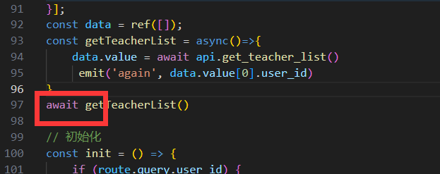
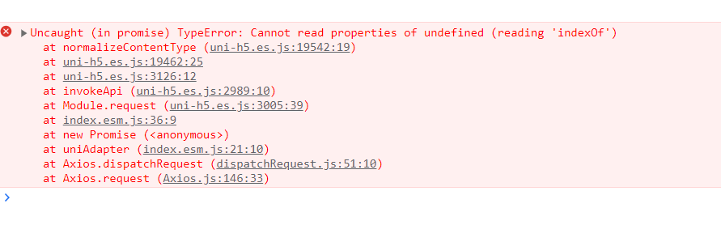
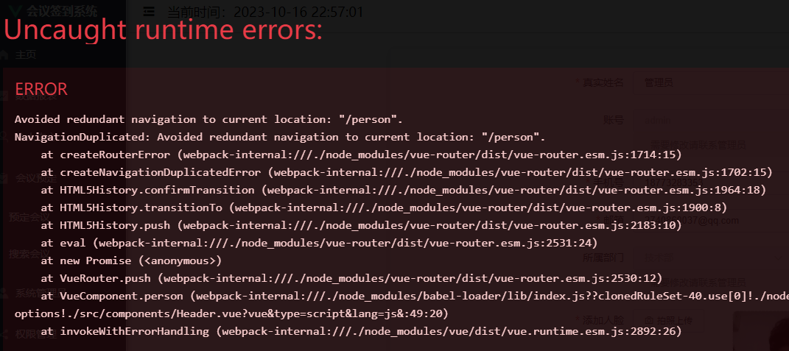
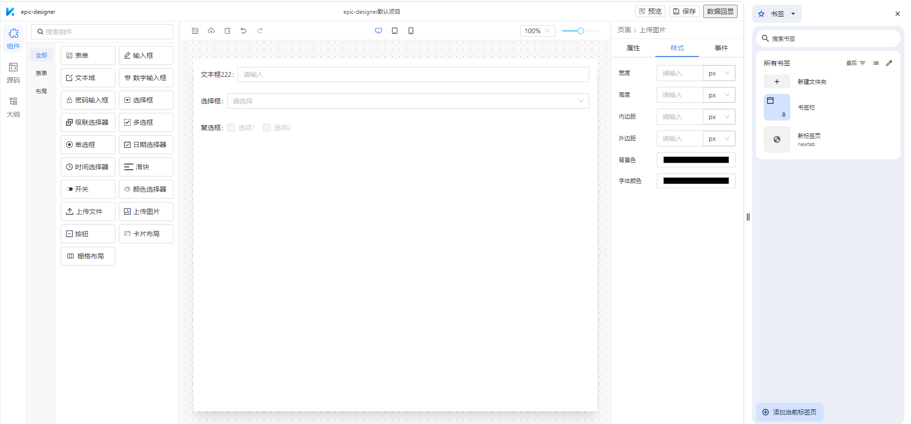

## 1.Suspense

` Component <Anonymous>: setup function returned a promise, but no <Suspense> boundary was found in the parent component tree. A component with async setup() must be nested in a <Suspense> in order to be rendered. `

`组件<Anonymous>: setup函数返回了一个promise，但是在父组件树中没有找到<悬念>边界。带有async setup()的组件必须嵌套在<悬念>中才能呈现`

这是因为我使用了vue3 的 setup语法糖  且在子组件中使用了await 相当于抛出了一个promise对象

****

此时我们子组件加载不出来

	

此时我们需要 ` <Suspense>`来包裹这个子组件

	

成功

	

## 2.开发环境图片打包路径问题

```
// 获取打包后的图片路径
const getImageUrl = (val) =>
    new URL(`../static/images/bg${val}.png`, import.meta.url).pathname;
```

`new URL`创建一个url对象，第一个参数匹配规则，第二个参数 `import.meta.url`获取当前的模块信息 

这个对象中有一个参数 **pathname** 可以获取到打包后的路径，解决打包后图片消失的问题

## 3.uniapp请求失败



傻逼uniapp必须自己设置请求头

```js
axios.defaults.headers['Content-Type'] = 'application/x-www-form-urlencoded;charset=UTF-8;multipart/form-data'
```

然后就能正常发请求了


### 3.1

问题延续


sb= uniapp

## 4.router跳转出错



**vue-router.esm.js:2046 Uncaught (in promise) NavigationDuplicated: Avoided redundant navigation to current location: "/xxx".**

这是因为vue-router 实例上的 push 方法返回的是 promise 对象，所以传入的参数期望有一个成功和失败的回调，如果省略不写则会报错。

1. 每次使用 push 方法时带上两个回调函数

   ```
   this.$router.push(`/xxx`, ()=>{}, ()=>{}) 
   ```

2. ：重写 Vue-router [原型对象](https://so.csdn.net/so/search?q=原型对象&spm=1001.2101.3001.7020)上的 push 函数

   ```js
   let originPush =  VueRouter.prototype.push;  //备份原push方法
    
   VueRouter.prototype.push = function (location, resolve, reject){
       if (resolve && reject) {    //如果传了回调函数，直接使用
           originPush.call(this, location, resolve, reject);
       }else {                     //如果没有传回调函数，手动添加
           originPush.call(this, location, ()=>{}, ()=>{}); 
       }
   }
   ```

   

## 5. An unexpected error occurred: "https:xxxx".



拉取这个项目后yarn一直报错


在网上查找之后时因为 【HTTPS 证书验证失败】

解决：

 ```
 yarn config list
 ```


```
我们将它改为false

yarn config set strict-ssl false
```

跳过HTTPS证书就可以了

